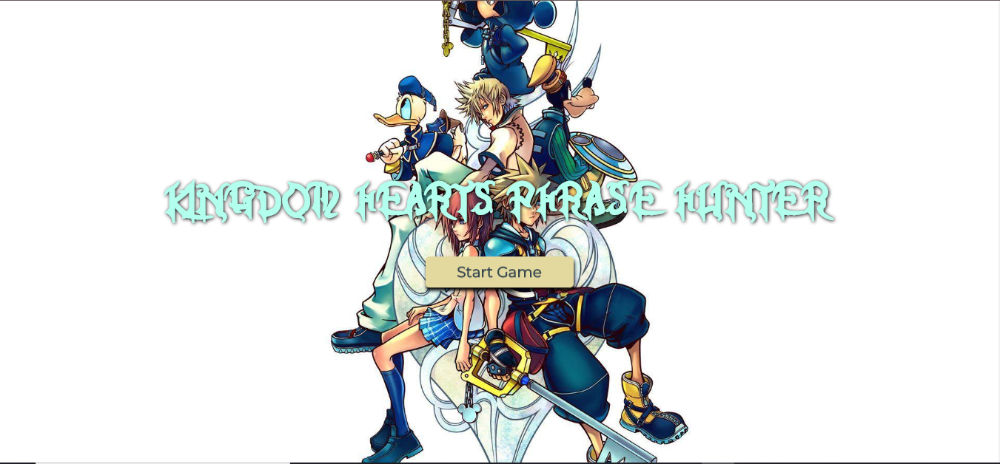
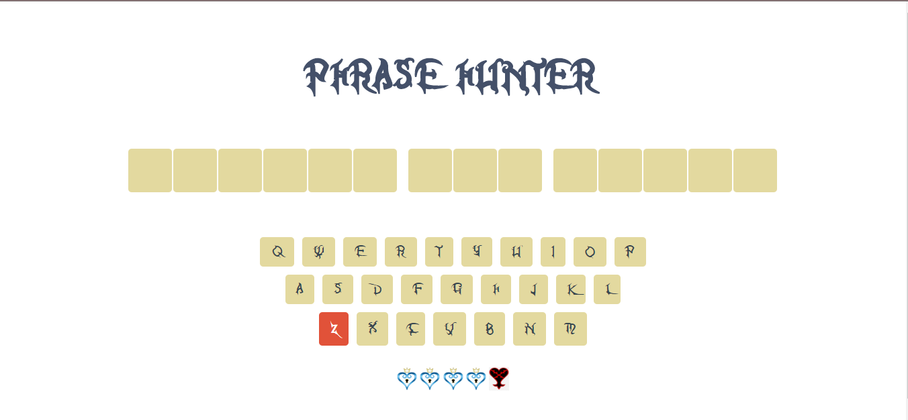
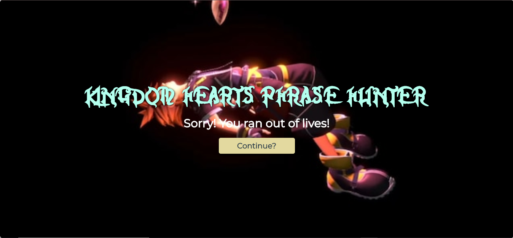
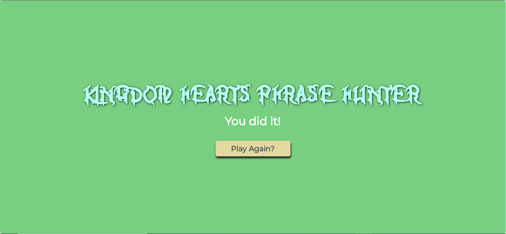

# OOP-Game-Show-app

# Interactive Form

---

This project uses Object-Oriented Programming as a way to better organize code using classes and methods to be more readable and accessible. Using JavaScript, I created two JavaScript classes with specific properties and methods. I created a Game class for managing the game, and a Phrase class to help with creating an array of Phrase objects.

Specific aspects of the game are:

- choose a random phrase, split the phrase into letters, and put those letters onto the gameboard.
- Each time the player guesses a letter, the program compares the letter the player has chosen with the random phrase. If the letter is in the phrase, the gameboard displays the chosen letters on the screen.
- A player continues to select letters until they guess the phrase (and win), or make five incorrect guesses (and lose).
- If the player completes the phrase before they run out of guesses, a winning screen appears. If the player guesses incorrectly five times, a losing screen appears.
- A player can guess a letter only once. After they’ve guessed a letter, your programming will need to disable that letter on the onscreen keyboard.

## Motivation

---

The motivation of this project is to highlight the usefulness of Object-Oriented programming to create clean, easy to read code and show the ability to apply code logic to create a game.

The benefits of applying Object-Oriented JS(OOJS) concepts are:

- By creating objects, you create related data of classes with properties and then apply methods onto those objects which allows for better organization and readability of code. This concept is called **_encapsulation_**.

- **_Abstraction_** in OOJS allows for certain properties and methods in an object to be "hidden" so that when changes are made to other parts of the codebase, those hidden properties and methods won't be affected.

- **_Inheritance_**: This allows for the reduction of redundancy in the codebase. For example, being able to use this(object class you are in).(propertyName) can save rewriting code over and over.

- **_Polymorphism_**: This was not used in the project, but it is an important concept in OOJS. This concept lets you refactor long if/else or switch statements in the codebase.

## Technology Used

---

This project uses the following technologies:

- HTML
- CSS
- Object-Oriented Vanilla JS

## Features

---

This project has several interesting features to make the code clean, more DRY, and more user friendly which are:

1. Using OOJS concepts to Create separate objects with their own unique classes, properties, and methods that perform different and important functions of the game.
2. Reusable helper methods to remove clutter from the code's major functions.
3. Both click and keydown functionality depending on if the user wants to use their keyboard or mouse to play.

## Code Example

---

```addPhraseToDisplay() {
    const randomPhrase = game.activePhrase.phrase.split("");
    const phraseDiv = document.getElementById("phrase").children[0];

    //iterate over the phrase and output each letter(maybe make as a helper function?)
    randomPhrase.map(letter => {
      const letterUpper = letter.toUpperCase();
      //if there is more than one letter and if it is not a space, then append to the page
      if (letter.length <= 1 && letter.match(/[a-zA-Z]/i)) {
        const element = this.createElement(
          "LI",
          "name",
          "letter",
          `hide letter ${letterUpper}`,
          letterUpper
        );
        this.appendChild(phraseDiv, element);
        //if it is a space, append with hide space class
      } else {
        const element = this.createElement("LI", "name", "letter", `space`);
        this.appendChild(phraseDiv, element);
      }
    });
    return randomPhrase;
  }
  //creates Element
  createElement(elementName, property, value, className, text) {
    const element = document.createElement(elementName);
    element[property] = value;
    element.className = className;
    element.textContent = text;
    return element;
  }
  //appends the element to the page
  appendChild(element, elementToBeAppended) {
    element.appendChild(elementToBeAppended);
  }
```

This code example shows of the main methods called addPhraseToDisplay which then has several helper methods to keep the main function from becoming too cluttered and hard to read.

## Screenshots

---






## Style Changes

---

The following style changes to the original Treehouse project are as noted:

1.) Background images added to overlay.
2.) Floating animation added to start button.
3.) Color pallete changes to the project.
4.) Heart images swapped out for different images.
5.) Changes in Text as well as custom fonts added.

## License

---

MIT © Jamie Gobeille
